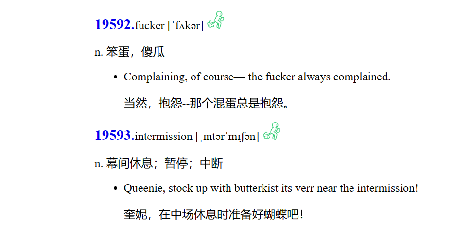

# dragon_english_page
An English learner's tool.

一个用于背单词的 web 页面，同时集成了 [goldendict-ng](https://github.com/xiaoyifang/goldendict-ng)。

注意：假设你已经安装并配置好了 goldendict-ng，点击单词的序号即可查询了（goldendict-ng的小灯泡要点击一下，enable-scanning）。

## Use

拉取项目：`git pull https://github.com/crazy-dragon/dragon_english_page.git`

安装依赖：`pip3 install jinja2`

执行代码：`python3 generate_htmls.py`

注意：假设你已经安装了 python3 的开发环境了。

## 注意事项

默认是没有音频的，把音频文件放入 audio 中即可（例如，单词 fucker, 对应的音频文件名为 fucker.mp3）。因为差不多 2 万个文件太大了，我就不上传了。我建议使用 TTS 生成的方式，如果实在解决不了可以加群：826057648。
